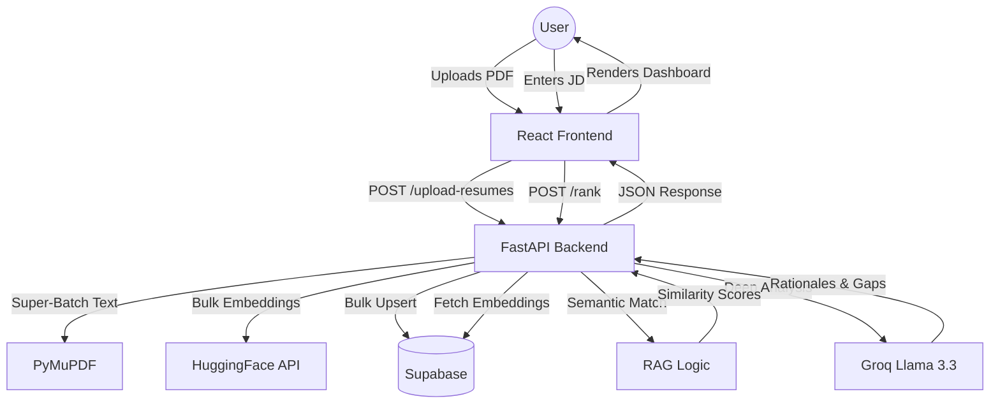

#  Resume Intelligence: High-Precision Candidate Discovery

**SleekScan** is a production-grade, AI-driven resume screening application that goes beyond simple keyword matching. It uses Deep Semantic Embeddings and Large Language Models (LLM) to intelligently rank, analyze, and optimize resumes against specific job descriptions.


### 🔗 Live URL: [https://resume-screener-eosin.vercel.app/](https://resume-screener-eosin.vercel.app/)

---

## 🎨 Design Philosophy: "The Modern Dashboard"

This repository features a complete UI/UX overhaul inspired by ChatGPT-style productivity tools. We prioritized **persistent history**, **dynamic themes**, and **cinematic typography**.

### Key UX Pillars:
- **Persistent Sidebar**: A ChatGPT-inspired dashboard for managing resume history and global settings.
- **Dual-Theme Engine**: Seamless transition between high-contrast **Light Mode** and deep **Dark Mode**.
- **Glassmorphism**: A "Liquid Glass" navigation system with `backdrop-blur-2xl` and refractive shadows.
- **Micro-Interactions**: Real-time upload status, spring-animated results, and requirement-stack validation.

---

## 🏗️ System Architecture



---

## 🧠 Intelligent Features

### 1. Semantic RAG Engine
Instead of matching local strings, we convert both the JD and the Resume into high-dimensional vectors. Conceptual matching allows the system to detect that "FastAPI" and "Django" both fit "Backend Developer" requirements.

### 2. Candidate Comparison Engine (New)
Select any two candidates to generate a qualitative LLM-driven verdict. The system analyzes their relative strengths and provides a clear reasoning on who is the better fit for the specific JD.

### 3. Super-Batch Processing
Optimized for speed. Multiple resumes are processed in parallel, with bulk embedding generation and single-transaction database operations, reducing upload time by up to 80%.

### 4. Recruiter-Grade Weighted Scoring
- **Frontend (30%)**
- **Backend (25%)**
- **Database (15%)**
- **Projects (20%)**
- **Extras/Tools (10%)**

---

## 🚀 Quick Start (Local Development)

### 1. Intelligence Engine (Backend)
```bash
cd backend
pip install -r requirements.txt
# Configure your .env with SUPABASE_URL, SUPABASE_SERVICE_KEY, and GROQ_API_KEY
uvicorn main:app --reload
```

### 2. Interface (Frontend)
```bash
cd frontend
npm install
npm run dev
```

---

## 🛠 Features at a Glance
- **Persistent History**: Never lose track of candidates with the new Sidebar cabinet.
- **Theme Switcher**: Optimized for late-night screening sessions.
- **ATS Optimizer**: Structured suggestions for bullet point rewriting.
- **Fast Startup**: Optimized database hydration for near-instant cold starts.

---

## 📜 Credits & Licensing
- **Original Engine**: Developed by [Shivam8292](https://github.com/Shivam8292)
- **UI/UX & Logic Refinement**: Optimized for Production Performance.
- **License**: MIT License

---

> [!NOTE]
> This project is designed for high-end human resources screening. Always verify candidate credentials beyond automated scoring.
