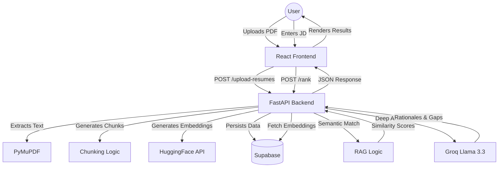

#  Resume Intelligence: High-Precision Candidate Discovery

**SleekScan** is a production-grade, AI-driven resume screening application that goes beyond simple keyword matching. It uses Deep Semantic Embeddings and Large Language Models (LLM) to intelligently rank, analyze, and optimize resumes against specific job descriptions.


---

## 🎨 Design Philosophy: "The Apple Standard"

This repository features a complete UI/UX overhaul inspired by high-end minimalist design systems. We prioritized **vertical rhythm**, **refractive glass surfaces**, and **cinematic typography** to deliver an experience that feels like a native macOS application.

### Key UX Pillars:
- **Clean Focus**: A single-line hero header and absolute minimalist input surfaces.
- **Glassmorphism**: A "Liquid Glass" navigation system with `backdrop-blur-2xl` and refractive shadows.
- **Micro-Interactions**: Spring-animated error handling and requirement-stack validation meters.
- **The File Cabinet**: A non-intrusive slide-out registry that manages candidates without shifting the main workspace.

---

## 🏗️ System Architecture



---

## 🧠 Intelligent Features

### 1. Semantic RAG Engine (Phase 1)
Instead of matching local strings, we convert both the JD and the Resume into high-dimensional vectors. This allows us to find a "Conceptual Match"—for example, detecting that "FastAPI" and "Django" both fit the "Backend Developer" requirement.

**How RAG works here:**
1. **Extraction**: Resumes are parsed into clean text.
2. **Chunking**: Large resumes are split into smaller, meaningful segments.
3. **Embedding**: Chunks are converted into 384-dimensional vectors using `MiniLM-L6`.
4. **Retrieval**: When a JD is submitted, we find the most relevant chunks from the database.
5. **Augmentation**: These relevant "evidence" chunks are fed to the LLM to generate precise rationales.

### 2. Intelligent Skill Mapping (Phase 2)
# AI Resume Screener (Recruiter-Grade Upgrade) 🚀🛸

Professional-grade AI Resume Analyzer with a 15-phase intelligence engine designed for high-precision recruiting.

## Key Features (15-Phase Logic)
- **Recruiter-Grade Weighted Scoring**: Candidates are scored across five critical technical categories with specific weights:
  - **Frontend (30%)**
  - **Backend (25%)**
  - **Database (15%)**
  - **Projects (20%)**
  - **Extras/Tools (10%)**
- **Semantic Skill Mapping**: Uses LLM-driven conceptual understanding (e.g., matching React to Next.js).
- **Evidence Mapping (Mandatory)**: Extracts exact lines from resumes to justify every identified strength.
- **Explainable AI (Rationale Engine)**: 2-3 line factual rationales for every score.
- **Smart Gap Detection**: Contextual identification of missing categories (e.g., "No backend framework exposure detected").
- **Confidence Scoring**: High/Medium/Low markers based on evidence quality.
- **ATS Optimizer (Resume Improver)**: Structured suggestions for bullet point rewriting and keyword optimization.

## Technical Architecture
- **Backend**: FastAPI (Python)
- **Intelligence**: Groq Llama 3.3 (Reasoning), OpenAI/HuggingFace (Embeddings)
- **Storage**: Supabase (Persistent Resumes & Chunks)
- **Frontend**: React (Vite) + Tailwind CSS

### Directory Structure
```text
/backend
  /services
    - embedding_service.py  # Production vectors
    - parsing_service.py    # JD Categorization
    - extraction_service.py # Resume Data Retrieval
    - scoring_service.py    # Weighted 15-Phase Engine
  /utils
    - text_cleaner.py       # Robust Extraction Fix
    - pdf_parser.py         # PyMuPDF Integration
  - main.py                 # FastAPI Standardized Endpoints
```

### 5. Recruiter Mode (Phase 5)
Handles large batches of resumes using **Asynchronous Parallel Processing** with fault tolerance. A single corrupt PDF won't crash your entire screening pipeline.

---

## 🚀 Quick Start (Local Development)

### 1. Intelligence Engine (Backend)
```bash
cd backend
pip install -r requirements.txt
# Configure your .env with SUPABASE_URL, SUPABASE_SERVICE_KEY, and GROQ_API_KEY
uvicorn main:app --reload
```

### 2. Interface (Frontend)
```bash
cd frontend
npm install
npm run dev
```

---

## 🛠 Features at a Glance
- **Multi-Resume Batching**: Upload dozens of candidate resumes simultaneously.
- **File Cabinet Management**: Slide-out access to all candidates with real-time match scores.
- **The Verdict**: Detailed comparative analysis between top-tier candidates.
- **High-Contrast Error Prevention**: intelligent banners that help you fix setup mistakes before they happen.
- **Global Minimalist Scrollers**: Custom-designed scrollbars that match the application's aesthetic.

---

## 📜 Credits & Licensing
- **Original Engine**: Developed by [Shivam8292](https://github.com/Shivam8292)
- **UI/UX Overhaul**: Refined by [Harshal Patel](https://github.com/HarshalPatel1972)
- **License**: MIT License

---

> [!NOTE]
> This project is designed for high-end human resources screening. Always verify candidate credentials beyond automated scoring.
