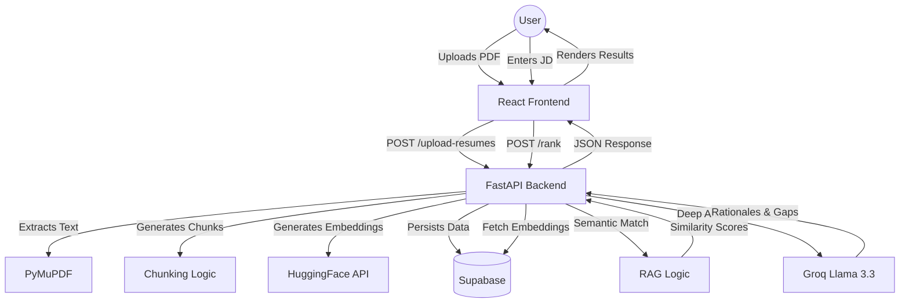

# SleekScan: AI-Powered Resume Screener 🚀

**SleekScan** is a production-grade, AI-driven resume screening application that goes beyond simple keyword matching. It uses Deep Semantic Embeddings and Large Language Models (LLM) to intelligently rank, analyze, and optimize resumes against specific job descriptions.

---

## 🛠️ Tech Stack

- **Backend**: FastAPI (Python), PyMuPDF (PDF Extraction).
- **AI/ML**: HuggingFace (Semantic Embeddings), Groq/Llama 3.3 (Intelligent Inference).
- **Vector Math**: NumPy & Scikit-Learn (Cosine Similarity).
- **Database**: Supabase (Cloud Persistence for PDFs and Embeddings).
- **Frontend**: React (Vite), Tailwind CSS (v4), Framer Motion (Premium Animations).

---

## 🏗️ System Architecture



---

## 🧠 Intelligent Features

### 1. Semantic RAG Engine (Phase 1)
Instead of matching local strings, we convert both the JD and the Resume into high-dimensional vectors. This allows us to find a "Conceptual Match"—for example, detecting that "FastAPI" and "Django" both fit the "Backend Developer" requirement.

**How RAG works here:**
1. **Extraction**: Resumes are parsed into clean text.
2. **Chunking**: Large resumes are split into smaller, meaningful segments.
3. **Embedding**: Chunks are converted into 384-dimensional vectors using `MiniLM-L6`.
4. **Retrieval**: When a JD is submitted, we find the most relevant chunks from the database.
5. **Augmentation**: These relevant "evidence" chunks are fed to the LLM to generate precise rationales.

### 2. Intelligent Skill Mapping (Phase 2)
Using LLM reasoning, the system identifies:
- **Conceptual Strengths**: Achievements and skills that match the spirit of the job.
- **Strategic Gaps**: Missing requirements beyond just literal words.
- **Experience Levels**: Junior, Mid, or Senior categorization based on project complexity.

### 3. Explainable AI: Rationale Engine (Phase 3)
Every score comes with a **Rationale**. The system explains its logic in 2-3 concise lines, ensuring the recruiter understands *why* a candidate was ranked high or low.

### 4. Resume Rewriter: ATS Optimizer (Phase 4)
Candidates can receive a custom **Optimization Plan** that includes:
- Impact-driven bullet point rewrites.
- Missing ATS-friendly keywords.
- Strategic career coaching suggestions.

### 5. Recruiter Mode (Phase 5)
Handles large batches of resumes using **Asynchronous Parallel Processing** with fault tolerance. A single corrupt PDF won't crash your entire screening pipeline.

---

## 🚀 Getting Started

### Prerequisites
- Python 3.10+
- Node.js 18+
- Supabase Project (Tables: `resumes`, `chunks`)
- API Keys: `HF_TOKEN`, `GROQ_API_KEY`, `SUPABASE_URL`, `SUPABASE_KEY`

### Backend Setup
```bash
cd backend
pip install -r requirements.txt
uvicorn main:app --reload
```

### Frontend Setup
```bash
cd frontend
npm install
npm run dev
```

---
*Developed with a focus on Premium UX and Production Reliability.*
