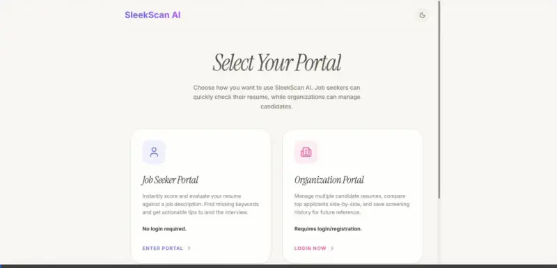
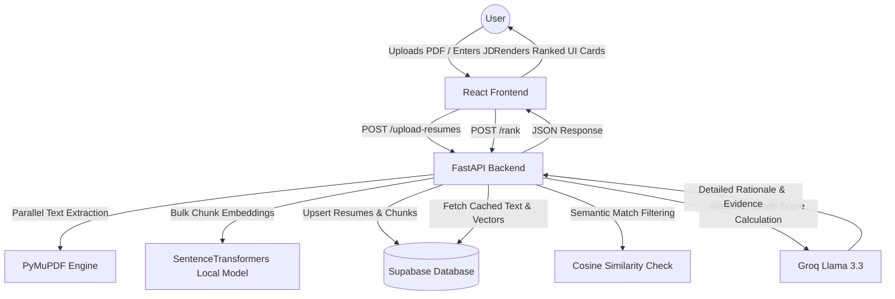

#  SleekScan AI: Recruiter-Grade Resume Intelligence

[](https://github.com/Shivam8292/Resume_screener)
[](LICENSE)
[](https://resume-screener-eosin.vercel.app/)

SleekScan AI is a production-grade, AI-powered resume screening and ranking platform that transforms candidate sourcing. Utilizing **Deep Semantic Embeddings** and the **Llama-3.3-70b-versatile model** on Groq, it intelligently evaluates, scores, and critiques resumes against complex job descriptions, providing recruiters with instant matching rationales and candidates with actionable optimization advice.

---

## 🎬 Live Demonstration


---

## 🏛️ System Architecture & Workflow
SleekScan AI executes resume parsing and candidate ranking through an asynchronous, high-performance search and evaluation pipeline.



* **Deterministic Intelligence Engine:** All LLM evaluations are strictly locked to `temperature=0.0`, eliminating model randomness and ensuring identical resume/JD combinations always yield identical scores.
* **Super-Batch Parallel Execution:** Multiple candidate uploads are processed concurrently. Text extraction, semantic indexing, and Supabase upserts run in asynchronous batches, reducing database latency by up to 80%.

---

## 🛠️ Technology Stack
| Component | Framework / Library | Purpose |
| :--- | :--- | :--- |
| **Frontend** | React 19, Vite 8, Tailwind CSS v4, Framer Motion | Premium minimalist dashboard, hardware-accelerated transitions, fluid animations |
| **Backend** | Python 3.11+, FastAPI, Uvicorn, Gunicorn | High-performance asynchronous REST API pipeline with robust error logging |
| **Database** | Supabase, PostgreSQL | Relational storage for resumes and high-dimensional vector embeddings |
| **AI LLM** | Groq SDK (`llama-3.3-70b-versatile`) | Fast, recruiter-grade candidate analysis, gap evaluation, and resume optimization suggestions |
| **Embeddings** | HuggingFace Local `sentence-transformers` | Semantic similarity calculation and vector chunking |
| **PDF Parser** | PyMuPDF (fitz) | Lightning-fast local PDF text extraction |

---

## ✨ Features
* **🎭 Dual-Portal Entry:** Smooth, zero-friction portal selector separating Job Seekers (no-login playground) and Organizations (full history tracking and recruitment pipeline).
* **🌓 Dual Theme Engine:** Smooth, hardware-accelerated transitions between Light and Dark mode built on CSS Variables.
* **🤖 Multi-Pillar Scoring Engine:** Analyzes candidates across Frontend, Backend, Database, Projects, and Extras using strict recruiter-grade rubrics.
* **📄 Qualitative Candidate Comparison:** Select any two candidate cards to generate a head-to-head comparison and structured hiring verdict.
* **🔧 Real-time ATS Optimizer:** Generates tailored suggestions, missing keywords, and custom bullet points to rewrite resumes matching the JD.

---

## 🚀 Quick Start (Local Development)

### Prerequisites
* Python 3.11 or higher
* Node.js 18 or higher
* Supabase Account & Database
* Groq API Key

---

### 1. Clone & Project Directory
```bash
git clone https://github.com/Shivam8292/Resume_screener.git
cd Resume_screener
```

---

### 2. Backend Setup
1. Navigate into the backend directory and set up a virtual environment:
   ```bash
   cd backend
   python -m venv venv
   # On Windows (PowerShell):
   .\venv\Scripts\activate
   # On Linux/macOS:
   source venv/bin/activate
   ```
2. Install dependencies:
   ```bash
   pip install -r requirements.txt
   ```
3. Create your `.env` configuration file in the `backend/` directory:
   ```env
   SUPABASE_URL=your_supabase_url_here
   SUPABASE_SERVICE_KEY=your_supabase_service_role_key_here
   GROQ_API_KEY=your_groq_api_key_here
   ```
4. Start the development server:
   ```bash
   uvicorn main:app --reload --port 8000
   ```

---

### 3. Frontend Setup
1. Open a new terminal in the root directory and navigate to the frontend:
   ```bash
   cd frontend
   ```
2. Install Node packages:
   ```bash
   npm install
   ```
3. Start the Vite dev server:
   ```bash
   npm run dev
   ```
   The portal will boot up on `http://localhost:5173/`.

---

## 🔒 Security & API Keys
> [!IMPORTANT]
> The environment configuration file (`.env`) contains sensitive database and AI provider credentials and is **explicitly ignored** under Git control using `.gitignore` patterns. Do not commit or push `.env` files to public code repositories. If your keys are ever exposed, revoke them immediately.

---

## 📁 Repository Structure
```
├── backend/
│   ├── services/                 # Business logic components
│   │   ├── parsing_service.py    # JD structuring logic
│   │   ├── extraction_service.py # Resume content structuring
│   │   ├── scoring_service.py    # Multi-pillar deterministic grading
│   │   └── embedding_service.py  # Local vector generation
│   ├── main.py                   # FastAPI routing endpoints
│   ├── requirements.txt
│   └── .env                      # Local environment keys (ignored)
├── frontend/
│   ├── src/
│   │   ├── components/           # UI widgets (LandingPage, ResultCard, Sidebar, etc.)
│   │   ├── App.jsx               # Navigation router & state hub
│   │   ├── index.css             # CSS tokens & custom styling overrides
│   │   └── main.jsx
│   ├── package.json
│   └── vite.config.js
└── docs/                         # Asset walk-throughs & demos
    └── demo.webp                 # Fully-rendered workflow demonstration video
```
